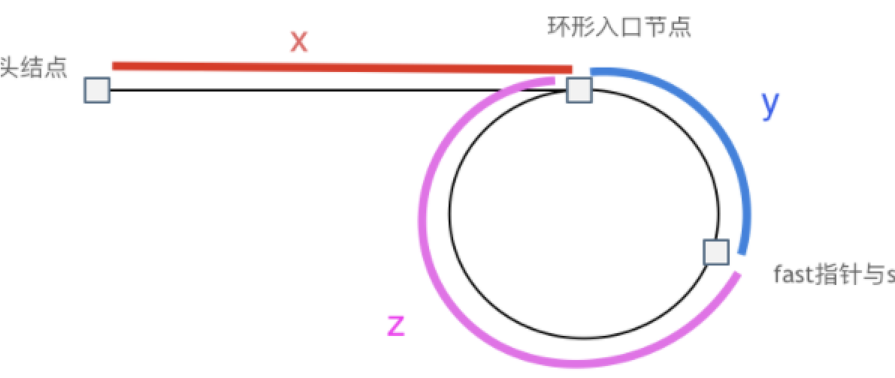

# 总结

## 1. 数组

### 二分查找

模板:(我就固定使用如下边界条件了)

```java
// right在右边界永远无法取到,因此区间为**左闭右开**区间,这将导致以下后果
// 1. while里面的判断条件是小于号
// 2. 如果target <  nums[mid], 说明目标数在左侧,需要缩小右边界,此时缩小后的右边界依旧无法取到,因此right = // mid
// 3. 无论怎么变,left的变化都是mid + 1
int left = 0, right = nums.length;
while(left < right){}
```

注意:求mid的时候,如果用位运算,其优先级低于加减乘除

$mid = left + (right - left >> 2)$

二分查找有时候会去查目的元素在最左侧的位置和最右侧的位置,如下:

诀窍在于判断的条件,假设要找最左侧,当target == num[mid]的时候,依然要向左找,因为左边可能还有,找最右侧的时候同理,但是这可能会引发两个最远端的时候的情况:

1. 当找最左侧位置时,活动的index指标为right: 如果这个right处于极限右侧的初始状态(right == nums.length),则说明数组内无该元素   如果处于极限左侧,数组内可能有,可能没有,需要判断nums[right] == taget.
2. 当找最右侧位置时,活动的index指标为left - 1:  如果left在极限左侧的初始状态(left == 0),则数组内无该元素  如果在极限右侧,需要判断nums[left - 1] == target

> 最左侧位置:
>
> ```java
> public int binaryLeft(int[] nums, int target){
>   int left = 0;
>   int right = nums.length;
>   while (left < right){
>     int mid = left + (right - left >> 1);
>     if (target <= nums[mid]){
>       right = mid;
>     } else {
>       left  = mid + 1;
>     }
>   }
>   // 得到左侧逼近的极限index后，如果这个index在极限左侧，这个index可能不是nums里面的数字，需要判断这个index的值和target是否相等
>   // 如果这个index在极限右侧，需要判断index是否超出数组
>   if (right == nums.length){
>     return -1;
>   }
>   return  nums[right] == target ? right : -1;
> }
> ```
>
> 最右侧位置:
>
> ```java
> public int binaryRight(int[] nums, int target){
>   int left = 0;
>   int right = nums.length;
>   while (left < right){
>     int mid = left + (right - left >> 1);
>     if (target >= nums[mid]){
>       left = mid + 1;
>     } else {
>       right = mid;
>     }
>   }
>   //如果极限右侧超出数组范围，需要判断left - 1是否等于最右边的那个值
>   //如果极限右侧在最左边，left == 0，说明
>   // if (target >= nums[mid]){
>   //                left = mid + 1;
>   //            }
>   //就没进去过，否则left至少要加个1，left == 0足以证明target不在数组中，在数组左侧，直接返回-1
>   if (left == 0){
>     return -1;
>   }
>   return nums[left - 1] == target ? left - 1 : -1;
> }
> ```


### 牛顿法开根号

根据一阶泰勒展开公示: f(x) = f(x0) + (x - x0) * f(x0)'

求根.即x ^ 2 = a

即f(x) = x ^ 2 - a  -> 令f(x) = 0  -> 即  x ^ 2 - a = 0

代入一阶泰勒,得出x1 = (x0 + a / x0) / 2

注意: 一开始的时候需要初始化一个x0,随便写一个数,比如1.0

```java
public int mySqrt(int x) {
  //Newton methos
  double startX = 1.0;
  while (Math.abs(startX * startX - x) > 0.1){
    startX = (startX + x / startX) / 2;
  }
  return (int) startX;
}
```

此外,开根号还可以用二分法来做

```java
public int mySqrt(int x){
  // 二分法
  if (x == 1) {
    return 1;
  }
  double left = 0;
  double right = x;
  double mid = left + (right - left) / 2;
  while (Math.abs(mid * mid - x) > 0.01){
    if (mid * mid < x){
      left = mid;
    } else if (mid * mid > x){
      right = mid;
    } else {
      return (int)mid;
    }
    mid = left + (right - left) / 2;
  }
  return (int)mid;
}
```

### 双指针与滑动窗口

双指针构造滑动窗口,可以理解为一个向前蠕动的毛毛虫，头向前进，尾向前缩，二者保持异步过程，整体向前进
通常来说,时间复杂度是O(N),因为每个元素进来一次出去一次，相当于O（2N）

本类型的滑动窗口非常好的例子是:

[904.水果成篮](https://leetcode-cn.com/problems/fruit-into-baskets/)

:求只包含了两个元素的最长子序列

[76.最小覆盖字串](https://leetcode-cn.com/problems/minimum-window-substring/)

通过这两个题发现,滑动窗口通常还和HashMap联系在一起,作为判断滑动窗口内的每个元素出现的次数

滑动串口最关键的问题在于,需要找到left移动的条件,也就是while 《什么什么条件》的情况下,left+=1,这个条件就是当窗口内不满足题意的时候的情况,而right则是每个回合都要向右移动的

同时,还需要注意在什么条件下满足了题意,应该保留一个可能的结果,在滑动窗口滑动的过程中去优化这个结果.

### 模拟之顺/逆时针遍历螺旋矩阵

纯模拟题，分为该矩阵是否是方阵，还是可以是长宽不等的矩阵，在遍历时，左右边界自己要定义好，我设置为左闭右开区间，如下分别为方阵和长宽不等矩阵的情况

方阵：需要注意如果n是奇数，要把中间那个遍历到

```java
public int[][] generateMatrix(int n) {
  //初始化正方形
  int[][] res = new int[n][n];
  int left = 0, right = n - 1, up = 0, down = n - 1;
  int number = 1;
  while (left < right && up < down){
    // 从左向右填充,左闭右开区间
    for (int y = left; y < right; y++) {
      res[up][y] = number;
      number += 1;
    }
    // 从上到下，左闭右开区间
    for(int x = up; x < down; x++){
      res[x][right] = number;
      number += 1;
    }
    // 从右到左，左闭右开区间
    for(int y = right; y > left; y--){
      res[down][y] = number;
      number += 1;
    }
    // 从下到上，左闭右开区间
    for(int x = down; x > up; x--){
      res[x][left] = number;
      number += 1;
    }
    left += 1;
    right -= 1;
    up += 1;
    down -= 1;
  }
  if (n % 2 != 0){
    res[n / 2][n / 2] = number;
  }
  return res;
}
```

长宽不等矩阵：需要注意一个长条或者一个竖条时，中间的核心那一排或者那一列的遍历

```java
public List<Integer> spiralOrder(int[][] matrix) {
  if (matrix == null || matrix.length == 0 || matrix[0].length == 0){
    return new ArrayList<>();
  }
  int m = matrix.length;
  int n = matrix[0].length;
  List<Integer> res = new ArrayList<>();
  int left = 0, right = n - 1, up = 0, down = m - 1;
  while (left < right && up < down){
    for (int y = left; y < right; y++){
      res.add(matrix[up][y]);
    }
    for (int x = up; x < down; x++){
      res.add(matrix[x][right]);
    }

    for (int y = right; y > left; y--){
      res.add(matrix[down][y]);
    }
    for (int x = down; x > up; x--){
      res.add(matrix[x][left]);
    }
    left += 1;
    right -= 1;
    up += 1;
    down -= 1;
  }
  if (up == down){
    for (int i = left; i <= right; i++){
      res.add(matrix[up][i]);
    }
  }else if (left == right){ // 走了一边就不能走另外一边，防止在m和n相等且同为奇数的情况下，重复添加中心元素
    for (int i = up; i <= down; i++) {
      res.add(matrix[i][left]);
    }
  }
  return res;
}
```

## 2. 链表

在链表的各种操作中，采用虚拟头节点是非常常见的，dummyNode，链表的操作，甚至后面的字符串的操作，其实有些也用到了双指针的题，双指针用处是真的挺多的。列出几个经典题：

### 反转链表：想象pre一开始指向null，cur指向head，最后cur指向null，pre已经指向需要的开头节点

```java
public ListNode reverseList(ListNode head) {
  //双指针法
  ListNode pre = null;
  ListNode cur = head;
  // 把temp的定义写在循环外面，节约内存
  ListNode temp = null;

  while (cur != null){
    temp = cur.next;
    cur.next = pre;
    pre = cur;
    cur = temp;
  }
  return pre;
}
```

给出一个递归解决，虽然这样看起来可以解决问题，但是让我自己写递归感觉还是很难写...

```java
// 递归法
public ListNode reverseList(ListNode head){
  return reverse(null, head);
}
private ListNode reverse(ListNode pre, ListNode cur){
  if (cur == null){
    return pre;
  }
  ListNode temp = cur.next;
  cur.next = pre;

  return  reverse(cur, temp);
}
```

### 相交链表：经典的相交链表，两个指针分别从两个链表开头开始遍历，直到遍历结束，分别从另外一个链表开头开始遍历，假设相交，则相等时一定是交点，数学问题。

```java
public ListNode getIntersectionNode(ListNode headA, ListNode headB) {
  ListNode curA = headA;
  ListNode curB = headB;
  // 基本思想：a + c + b = b + c + a,结束循环的时候，curA一定就是交点
  // 如果两个都不相交，则curA和curB会同时移动到null，退出循环，curA为null依然是正确的
  while (curA != curB){
    curA = curA == null ? headB : curA.next;
    curB = curB == null ? headA : curB.next;
  }
  return curA;
}
```

### 环形链表：不仅仅要判断链表是否有环，还要判断交点在哪，实际上这是一个数学问题，有没有环可以用快慢指针判断，然后用快指针走过的路程是慢指针的2倍列出等式，可以得出等式关系



在这就是 x = z

```java
public ListNode detectCycle(ListNode head) {
  /**
         * 本题通过数学公示算出，用快慢指针找到交点后，（a + b） * 2 = a + b + c + b;
         * a = c;
         * 找到交点后，同时用两个指针，分别指向起点，和快慢指针相遇的点，等这两个指针相遇，则为交点
         */
  ListNode slow = head;
  ListNode fast = head;

  while (fast != null && fast.next != null){
    fast = fast.next.next;
    slow = slow.next;
    if (slow == fast){
      ListNode start = head;
      ListNode intersection = slow;
      while (start != intersection){
        start = start.next;
        intersection = intersection.next;
      }
      return start;
    }
  }
  //说明无环
  return null;
}
```

## 3. 哈希表

先插一句嘴，哈希函数是区块链技术中的重要技术

三个常见的哈希结构：

+ 数组
+ set
+ map

而java中set和map都提供了几种数据结构，其中应该主要分为红黑树和哈希表为底层结构，红黑树key有序，哈希表无序

### 采用数组作为哈希表：判断字母异位词，这个方法针对小写字母非常有效

```java
public boolean isAnagram(String s, String t) {
  /**
         * 既然都是小写，不如每一个小写字符，都和a做减法，从而转化为数组
         */
  int[] record = new int[26];
  for (char c : s.toCharArray()){
    record[c - 'a'] += 1;
  }
  for (char c : t.toCharArray()){
    record[c - 'a'] -= 1;
  }
  for (int i : record){
    if (i != 0){
      return false;
    }
  }
  return true;
}
```

### 两数之和，三数之和，四数之和

两数之和就不说了，说下三数之和和四数之和

实际上三数之和和四数之和很像，是求能否找到**不重复**的几个（3或者4）数，使得相加等于target

如果直接暴力运行，那就是On3，或者On4，但是可以采用双指针（但是也不是所有的双指针都要排序），但是这类题在使用双指针的时候先排个序，因为要判断a+b+c和target的关系，来决定left和right的移动方法。这样，外层一层或者两层for，内部再双指针，可以减少循环的一层，变成On3和On3

三数之和

```java
public List<List<Integer>> threeSum(int[] nums) {
  /**
         * 这道题可以采用hash表解决，但是由于不能包含重复的三元组，在去重时不好操作，同时细节比较多，很难直接写出bug-free的code
         * 可以采用双指针的方法解决，首先将数组排序，i即为遍历坐标，left为i+1，right为length-1
         * 回过来想，两数之和能不能用双指针？题目要求返回index，而本类需要采用排序，才能让left和right移动，因此两数之和假如让返回实际对值可以用双指针
         */
  Arrays.sort(nums);
  List<List<Integer>> res = new ArrayList<>();
  for (int i = 0; i < nums.length; i++) {
    // 排序后第一个都大于0，就不可能凑成三元组
    if (nums[i] > 0) {
      return res;
    }
    //开始对i去重复
    if (i > 0 && nums[i] == nums[i - 1]){
      continue;
    }
    int left = i + 1, right = nums.length - 1;
    while (left < right){
      if (nums[i] + nums[left] + nums[right] < 0){
        left += 1;
      } else if (nums[i] + nums[left] + nums[right] > 0){
        right -= 1;
      } else {
        //从数组构造array可以这么构造
        res.add(Arrays.asList(nums[i], nums[left], nums[right]));
        // 在这里要再次去重
        while (left < right && nums[left] == nums[left + 1]){
          left += 1;
        }
        while (left < right && nums[right] == nums[right - 1]){
          right -= 1;
        }
        left += 1;
        right -= 1;
      }
    }
  }
  return res;
}
```

四数之和，但是四数之和一开始不要判断`nums[k] > target`，记住

```java
public List<List<Integer>> fourSum(int[] nums, int target) {
  /**
         * 双指针法将时间复杂度：$O(n^2)$的解法优化为 $O(n)$的解法
         * 外层用两个for，定住ij，内层在用left和right，相当于是时间复杂度o3
         */
  List<List<Integer>> res = new ArrayList<>();
  Arrays.sort(nums);

  for (int i = 0; i < nums.length; i++) {
    if (i > 0 && nums[i] == nums[i - 1]){
      continue;
    }

    for (int j = i + 1; j < nums.length; j++){
      if (j > i + 1 && nums[j] == nums[j - 1]){
        continue;
      }

      int left = j + 1, right = nums.length - 1;
      while (left < right){
        int sum = nums[i] + nums[j] + nums[left] + nums[right];
        if (sum > target){
          right -= 1;
        } else if (sum < target){
          left += 1;
        } else {
          res.add(Arrays.asList(nums[i], nums[j], nums[left], nums[right]));
          while (left < right && nums[left] == nums[left + 1]){
            left += 1;
          }
          while (left < right && nums[right] == nums[right - 1]){
            right -= 1;
          }

          left += 1;
          right -= 1;
        }
      }
    }
  }
  return res;
}
```

## 4. 字符串

